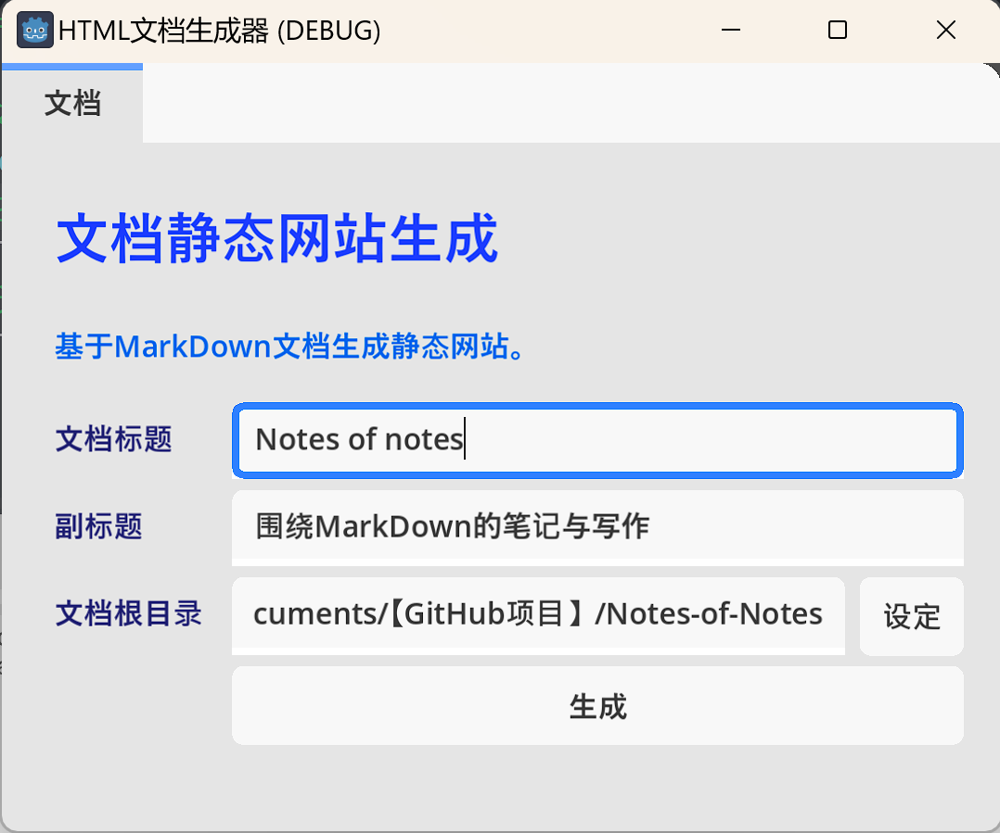
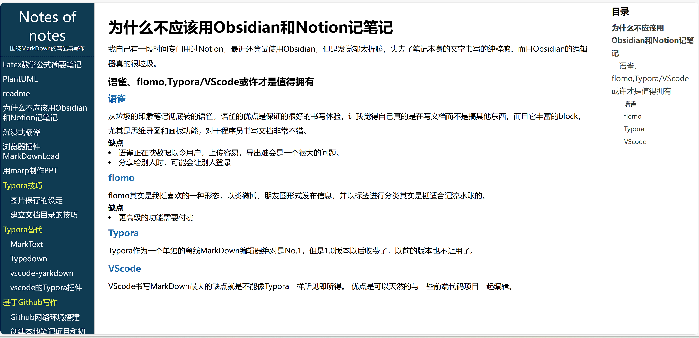
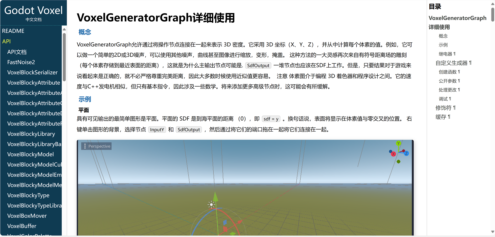

# 基于Godot的静态网站生成系统

## 概述

起初，我只是想基于本地的文件夹生成一个静态的图片浏览网站，可以在本地基于简单的文件夹结构创建和管理，并且随时一键生成。

之后，我又尝试了基于本地的MarkDown生成HTML文档。

当然还尝试过生成视频合集静态站。

这一切都基于Godot4.x和GDScript，以及我长期以来和新近编写的一些静态函数库和类。

本着专一化的目的，我于2023年10月11日正式将其从原来的Script++项目的测试中独立出来，作为一个单独的Godot4.x项目，并将其开源于GitHub。

我会逐步改进之前编写的烂代码，让其结构更加清晰易用易理解和可扩展。

您可以自行基于这个项目编译exe或其他平台的可执行程序。作为一个单独的桌面应用程序使用。

## 2023年10月11日更新

### 基于场景的界面

之前在Script++项目的测试阶段，没有为其创建UI，这里为其创建了初步的UI界面，您可以更方便的设置和创建文档项目。

生成的文档如下：

其他的文档截图：

